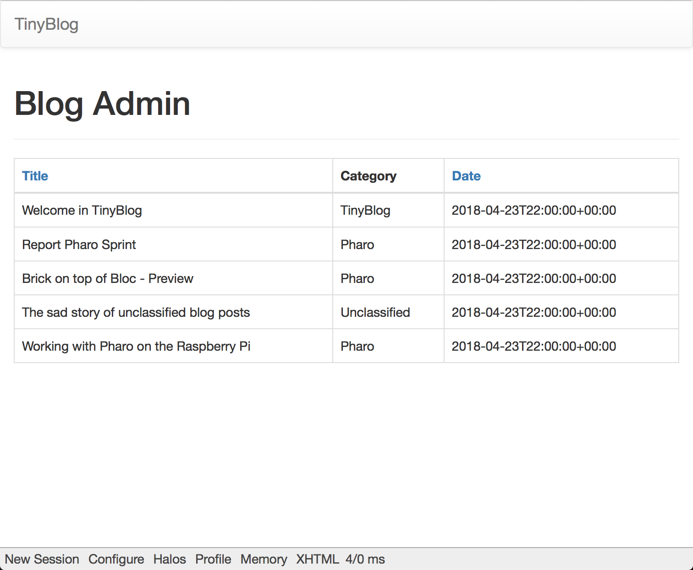
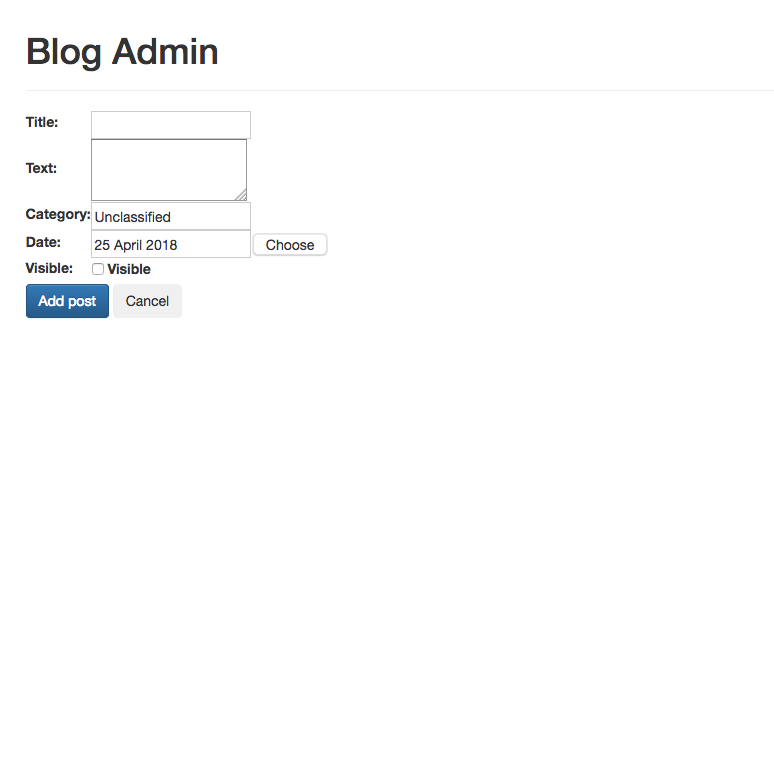

# Some notes for TinyBlog

## Corrections and suggestions

* ### -[ ] 1.2(Installation de Pharo) suggestion

  Maybe we should explain how to install libraries using Pharos's Catalog Browser

* ### -[x] 1.3(Règles de nommage) syntax error

  Cette solution est toutefois plus contraingnante si **vous** implémentez des fonctionnalités...

* ### -[ ] 2.0(L’application TinyBlog : présentation et modèle) suggestion

  Same text as is 1.0 and same picture, maybe remove one of them..

* ### -[x] 2.7(Sauvegarder votre code) syntax error

  Incorrect link : ~~http://W1/C019-W1S-Videos-Redo-Counter-Traditional-FR-v4.mp4~~ to remplace by **http://rmod-pharo-mooc.lille.inria.fr/MOOC/Videos/W1/C019-W1S-Videos-Redo-Counter-Traditional-FR-V3-HD_720p_4Mbs.m4v**.

* ### -[x] 2.7 syntax error

  Une telle reproduc**t**ibilité permet alors...

* ### -[x] 3.1(La classe TBBlog) syntax error

  Nous allons développer **la** classe TBBlog qui contient des posts...

* ### -[x] 3.4(Un premier test) suggestion

  Add the missing method name in this sentence : Ce test ne passe pas (n’est pas vert) car nous n’avons pas défini les méthodes: writeBlogPost: , removeAllPosts **et size**. Ajoutons-les.

  Also remove the comment, we are not yet writing in the database

  ```
  TBBlog >> writeBlogPost: aPost
  	"Write the blog post in database"
  	posts add: aPost
  ```

* ### -[x] 4.1(Configurer Voyage pour sauvegarder des objets TBBlog) suggestion 

  This method is unchanged, maybe remove it:

  ```
  TBBlog class >> initialize
  	self reset
  ```


* ### -[x] 4.1 correction

  If we remove the instance variable uniqueInstance we should change the TBBlog class reset method :

  ```
  TBBlog class >> reset
  	"self reset"

  	self current remove.
  	self initializeLocalhostMongoDB
  ```

* ### -[ ] 4.7(Connexion à un serveur local) correction

  * TODO : <!> this part has been changed in the lastest version of the book, I didn't checked yet where it is... <!>

  We have to make tests independant when mongoDB is set:
  change local repo to Voyage temporary repin the setUp method

  ```
  TBBlogTest >> setUp
  	normalRepository := VORepository current.
  	VORepository setRepository: VOMemoryRepository new.
  	blog := TBBlog current.
  	first := TBPost title: 'A title' text: 'A text' category: 'First Category'.
  	blog writeBlogPost: first.
  	post := (TBPost title: 'Another title' text: 'Another text' category: 'Second Category') beVisible
  ```

  Come back to local Database repo in the tearDown method

  ```
  TBBlogTest >> tearDown
  	VORepository setRepository: normalRepository
  ```

* ### -[x] 5.2(Point d’entrée de l’application) syntax error
  	
  En effet les méthodes initialize de classe ne sont automatiquement exécutées que ~~l’on~~ **lors** du chargement de la classe.

  Also repetition of this sentence.

* ### -[x] 5.4(Composants visuels pour TinyBlog) syntax error 

  La figure 5-5 montre les différents composants que nous allons développer et **où** ils se situent.

* ### -[x] 5.17(Rendu des catégories) correction

  Missing the method **beActive** to render the same as the figure.

  ```
  TBCategoriesComponent >> renderContentOn: html
  	html tbsListGroup: [ 
  	html tbsListGroupItem beActive; with: [html strong: 'Categories' ].
  	categories do: [ :cat | self renderCategoryLinkOn: html with: cat ] ]
  ```

* ### -[x] 5.18(Mise à jour des Posts) syntax error

  One too many "]" in this code :

  ```
  TBPostsListComponent >> postComponents
  	postComponents := self readSelectedPosts
  	collect: [ :each | TBPostComponent new post: each ] ].
  	^ postComponents
  ```

* ### -[x] 6.2(Composant d’identification) syntax error

  Nous définissons une nouvelle **sousclasse** de la classe WAComponent et des accesseurs. Ce composant contient un compte d’administration, le mot de passe associé ainsi que le composant **à invoquer** pour accéder à l’administration.

* ### -[ ] 6.2 suggestion

  Better reformulate this sentece :

  Les boutons définissent par défaut le bouton nommé 'SignIn' et son action est de vérifier l’adéquation entre le mot de passe et le compte.

* ### -[ ] 6.2 suggestion

  This code doesn't work because gotoAdministration isn't implemented yet and "component" is missing betwin self and gotoAdministration.

  ```
  TBAuthentificationComponent >> validate
  	(self account = 'admin' and: [ self password = 'password' ])
  		ifTrue: [ self gotoAdministration ]
  ```

  The code of this method is missing ```TBAuthentificationComponent >> gotoAdministration```

  Btw this two methods are implemented in the 6.5 section (named "Administration des posts").

* ### -[ ] 6.3(Intégration de l’authentification) answer

  To do : Why here we do not see the component. I do not get it

  Because display is set to none so it's here but hidden. And it's revealed thanks to the JS scrip called by renderSignInOn method.

* ### -[x] 6.6(Le composant PostsReport) syntax error

  Comme le rapport est un composant fils du composant admin nous n’oublions pas de ~~re~~définir la méthode children comme suit.

* ### -[ ] 6.7(Amélioration des rapports) picture correction

  Actually the picture 6-3 isn't the right one. This is how it is : 

* ### -[x] 6.8(Gestion des posts) syntax error

  Need to rename TBSMagritteReport to TBPostsReport in the code section.

* ### -[?] 6.8 suggestion (not sure about this one but I did it anyway)

  Maybe change this code to have the same date factoring as on picture 6-4

  ```
  TBPost >> date
  	^ date asDate
  ```

* ### -[x] 6.9(Implémentation des actions CRUD) correction 

  This sentence should be changed : 

  Enregistrez-vous et vous devez obtenir la situation telle que représentée par la figure 6-5. 

  to :

  Enregistrez-vous et en cliquant sur le nouvel élément que nous venons d'ajouter, vous devez obtenir la situation telle que représentée par la figure 6-5.

* ### -[ ] 6.9 picture correction

  The picture 6-5 is different it's more like this : 

* ### -[ ] 6.11(Amélioration de l’apparence du formulaire) suggestion

  At the end it tells that is shoud be like picture 6-6 (Formulaire d’ajout d’un post avec Bootstrap) but maybe actual picture 6-5 (Ajout d’un post) is more appropriate. Also the picture 6-6 (Formulaire d’ajout d’un post avec Bootstrap) isn't an add post form but an edit post form so the picture doesn't correspond to it's description.


## Things that could be added

* -[ ] to remove all data from mongo Database

if you can't do it with pharo (while mongod is running)
 
```mongo tinyblog --eval "db.dropDatabase()"```


* -[ ] TODO
* * remove categories of not visible posts.
* * there is an error when blog is empty on the admin side.


(this is just a reminder for me)
/Applications/Pharo6.1-64.app/Contents/Resources
../MacOS/Pharo Pharo.image